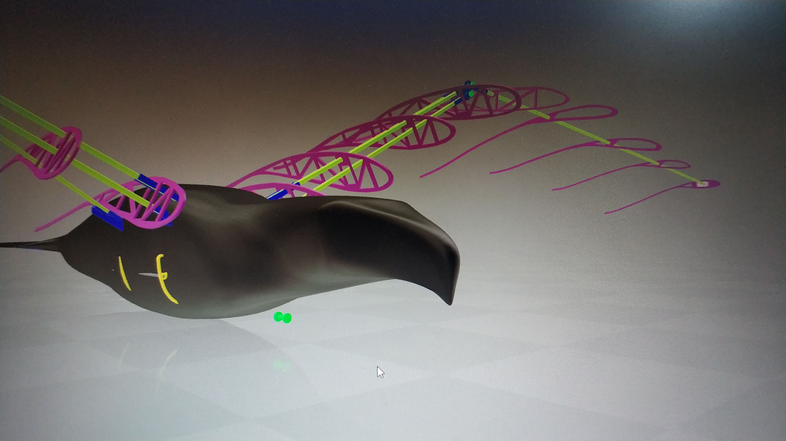
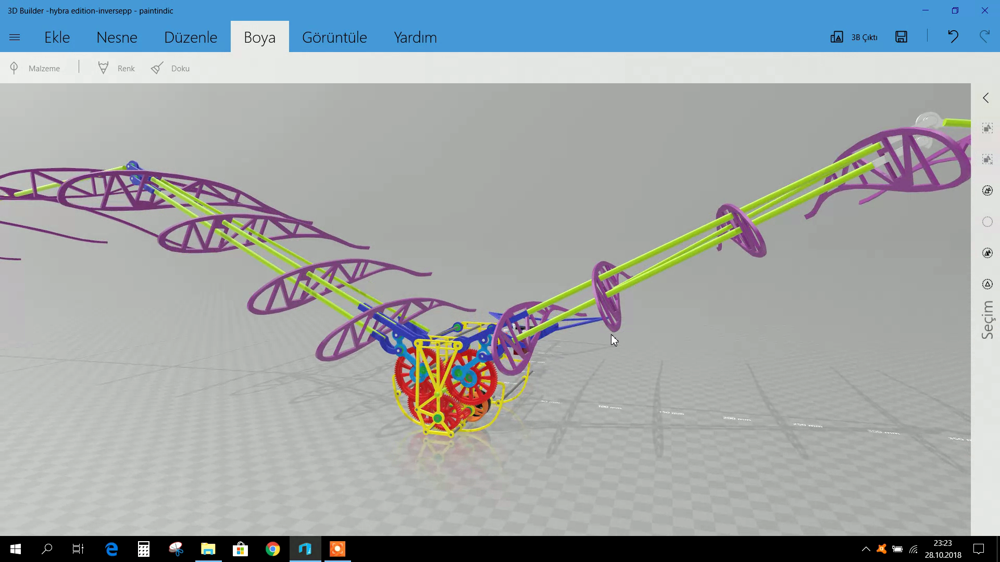
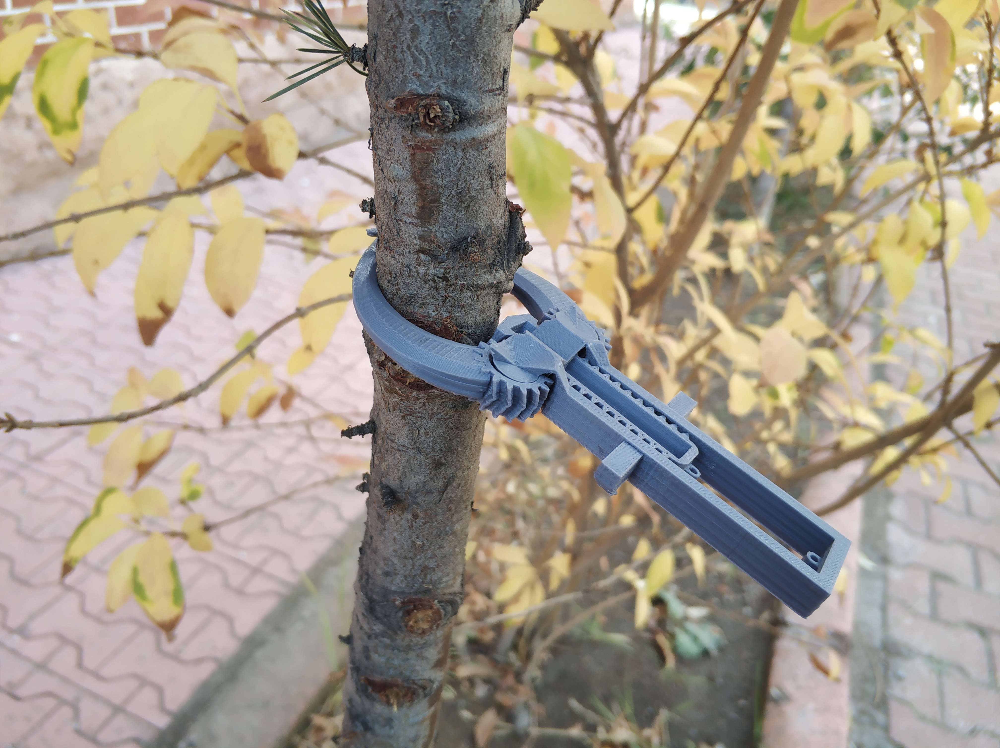
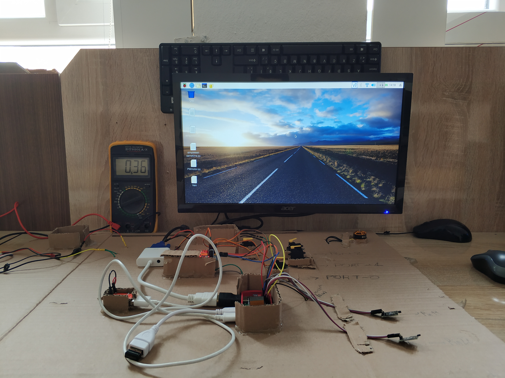
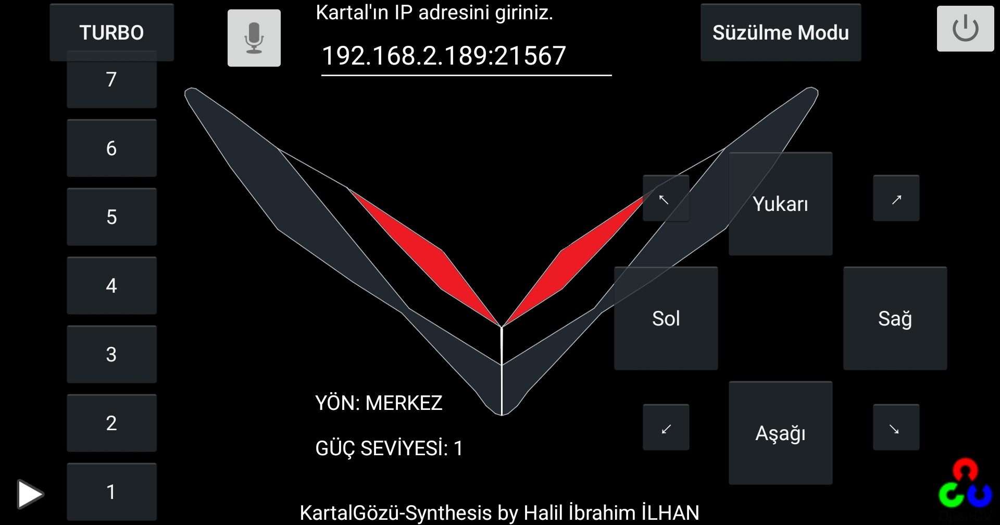
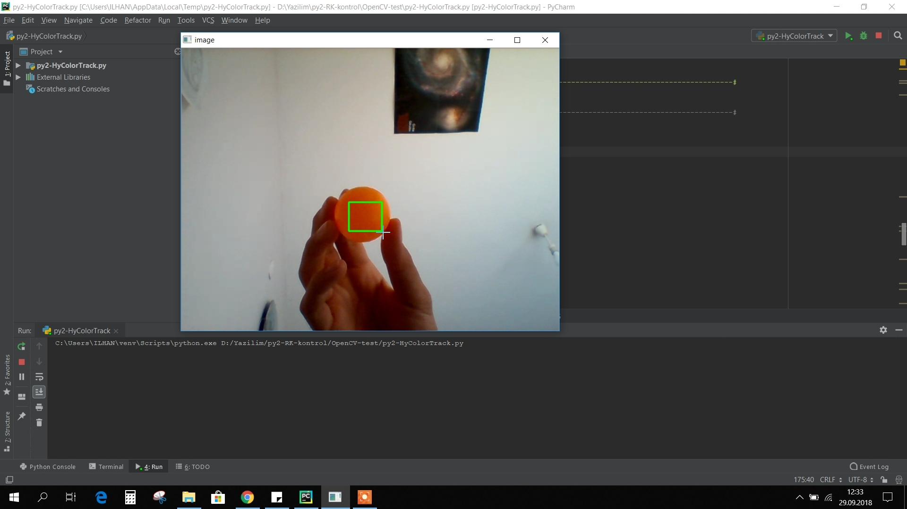
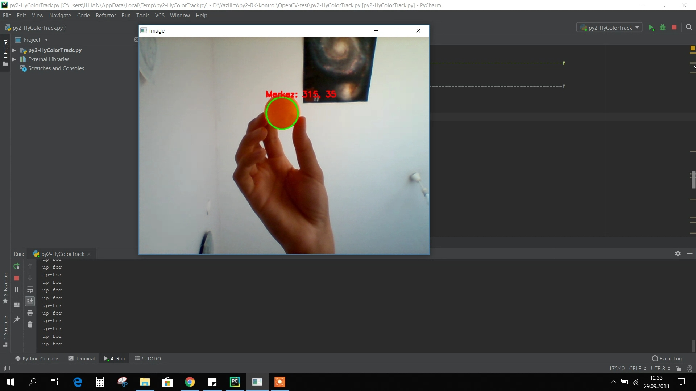

# Biological-Formed-Spy-UAV
Biyolojik formlu casus İHA tasarımı.

İlk prototip:

# 3D Design
İHA'nın 3 boyutlu modeli Solidworks ve Fusion 360 çizim araçlarıyla tasarlandı.

# Dişli Kutusu
Dişli kutusu 3D baskı yöntemiyle üretildi. 2300kv fırçasız motorun devri dişli kutusu ile 150 kat düşürülülerek gerekli güç sağlanıyor.

# Landing System
İniş mekanizması kuşların konma hareketinden yola çıkılarak geliştirildi.

# Electronics Test Panel
Geliştirme sürecinde elektronik sistem ve yazılımın testlerini gerçekleştirdiğimiz pano:

# Control App
Motor ve sensörler [KartalGzSpywareCam](https://github.com/hybrayhem38/KartalGzSpywareCam) Android uygulama ile kumanda edilmektedir.

Hedef takip yazılımı:

